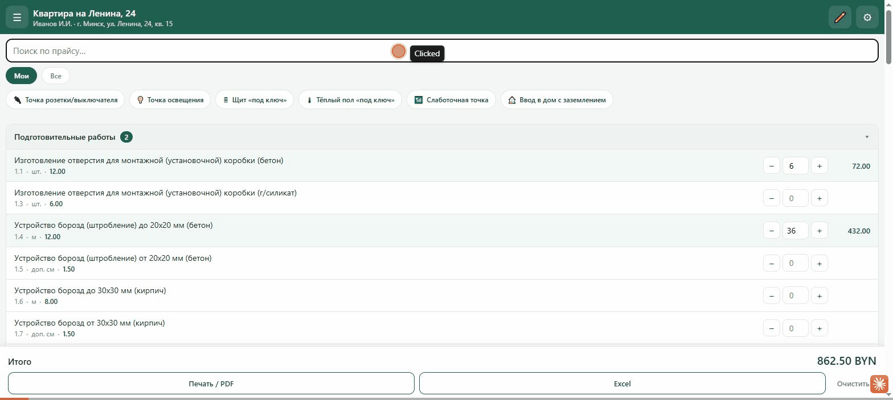
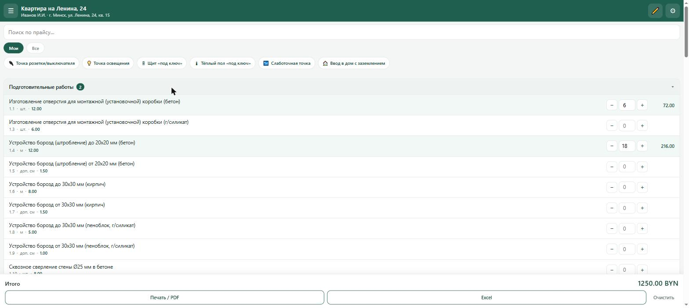
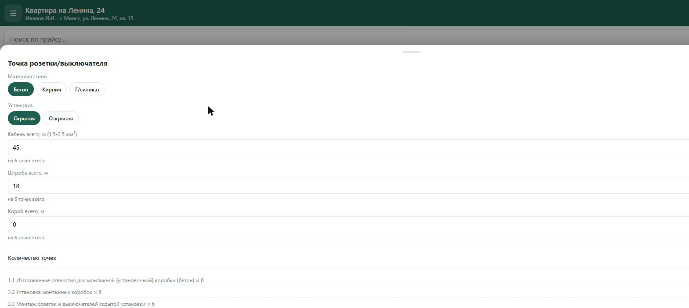
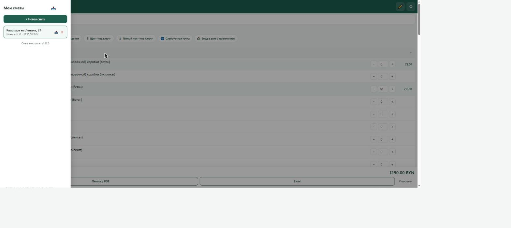
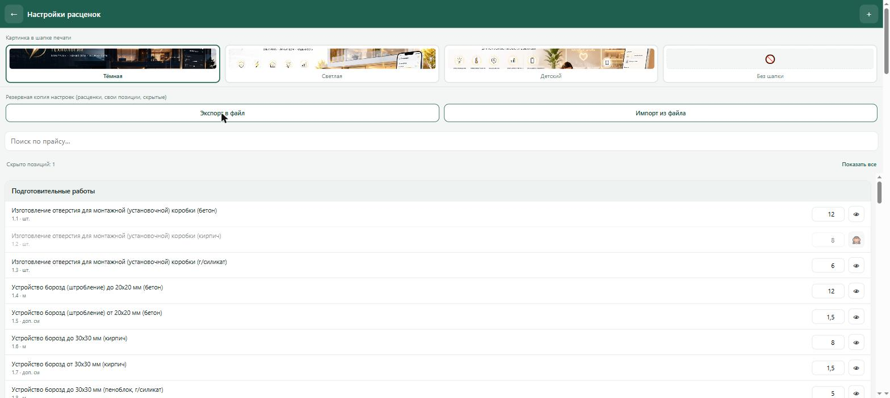
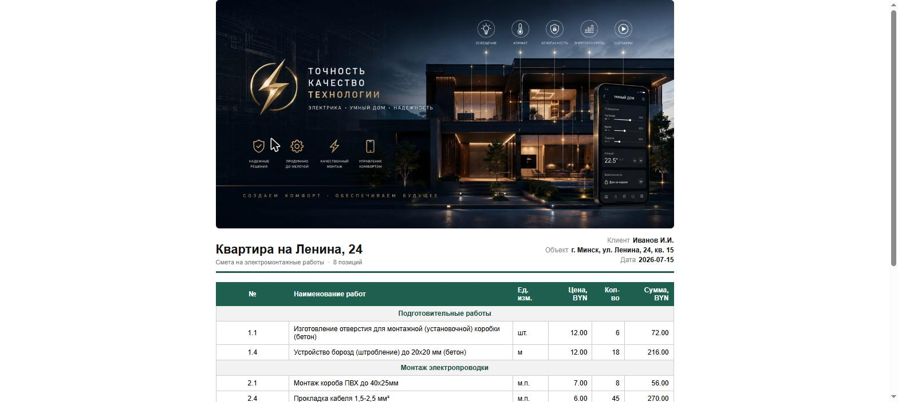

# ⚡ Смета электрика

Приложение для быстрого расчёта сметы на электромонтажные работы. Работает как обычное приложение на Android (PWA) — без Play Store, устанавливается по ссылке и работает офлайн.

**Установить:** [tores-kun.github.io/smeta](https://tores-kun.github.io/smeta/)

## Что умеет

- Прайс-лист на 74 позиции (8 разделов): подготовительные работы, электропроводка, электроустановочные изделия, щитовое оборудование, освещение, тёплый пол, слаботочка, подключение оборудования
- Выбор работ и ввод количества — сумма считается автоматически
- Несколько смет одновременно — для разных клиентов и объектов, с быстрым переключением между ними
- Быстрый ввод комбо-позициями: «Точка розетки/выключателя», «Точка освещения», «Щит «под ключ»», «Тёплый пол «под ключ»», «Слаботочная точка», «Ввод в дом с заземлением» — сами проставляют нужные строки прайса по указанным параметрам
- Обмен сметами: экспорт в файл и импорт обратно (например, коллеге) — если расценки в файле отличаются от ваших, приложение спросит, какую цену оставить
- Настройки: можно менять расценки, добавлять свои позиции, скрывать то, что редко нужно
- Резервная копия настроек: весь прайс-лист (включая свои позиции и изменённые цены) можно сохранить в файл и восстановить на другом телефоне или после переустановки
- Печать / экспорт в PDF с брендированной шапкой (4 варианта картинки на выбор, включая «без шапки») и экспорт в Excel
- Всё хранится локально на телефоне, интернет не нужен (кроме первой загрузки и экспорта в Excel)

## Как пользоваться

### 1. Список работ и расчёт

Открываете смету — видите прайс-лист по разделам. Вводите количество нужным работам — сумма по строке и общий итог считаются сразу. Кнопка «Все» вверху показывает и редко используемые позиции, которые скрыты в обычном режиме «Мои».

### 2. Быстрый ввод комбо-позициями

Вместо того чтобы искать и заполнять 3-5 строк вручную, нажмите на комбо-плашку сверху (например, «Точка розетки/выключателя»), укажите материал стены и способ монтажа, впишите общий метраж кабеля/штробы/короба **на все точки сразу** (не на одну точку — приложение само умножит только те позиции, которые считаются поштучно) и количество точек. Приложение соберёт нужные строки и добавит их в смету одной кнопкой.

### 3. Несколько смет, экспорт и импорт

В меню (☰) — список всех ваших смет. «+ Новая смета» создаёт новую и сразу открывает данные (клиент, адрес, дата). Значок 📤 у каждой сметы сохраняет её в файл, 📥 в шапке меню — загружает смету из файла обратно. Если цены в файле отличаются от ваших текущих — приложение покажет список расхождений и даст выбрать, какую цену оставить по каждой позиции.

### 4. Настройки: расценки, свои позиции, шапка печати

В настройках (⚙) можно менять цену любой позиции, добавлять свои (кнопка «+» вверху), скрывать редко используемые из основного списка. Здесь же — выбор картинки для шапки печати (тёмная / светлая / детская / без шапки) и кнопки «Экспорт в файл» / «Импорт из файла» для резервной копии всех этих настроек — полезно перед переустановкой приложения или при переходе на новый телефон.

### 5. Печать и экспорт

Кнопка «Печать / PDF» открывает диалог печати браузера — можно распечатать или сохранить как PDF с красивой шапкой, данными клиента, таблицей позиций и местом для подписей. Кнопка «Excel» выгружает ту же смету в таблицу .xlsx.

## Как установить на телефон

1. Откройте [tores-kun.github.io/smeta](https://tores-kun.github.io/smeta/) в Chrome на Android
2. Меню (три точки) → **«Добавить на главный экран»** / **«Установить приложение»**
3. Готово — иконка на рабочем столе, работает как обычное приложение
